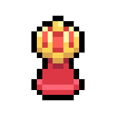

[![Contributors][contributors-shield]][contributors-url]
[![Forks][forks-shield]][forks-url]
[![Stargazers][stars-shield]][stars-url]
[![Issues][issues-shield]][issues-url]
[![Apache-2.0 License][license-shield]][license-url]

 

  

<h3 align="center">Chess vs Elves</h3>

  

    A parody of "Plants vs Zombies", with chess and elves
     
    <a href="https://github.com/Befrimon/Chess-vs-Elves/issues/new?labels=bug&template=bug-report---.md">Report Bug</a>
    ·
    <a href="https://github.com/Befrimon/Chess-vs-Elves/issues/new?labels=enhancement&template=feature-request---.md">Request Feature</a>
  

  
Table of Contents

  <ol>
    <li>
      <a href="#about-the-project">About The Project</a>
    </li>
    <li>
      <a href="#getting-started">Getting Started</a>
      <ul>
        <li><a href="#prerequisites">Prerequisites</a></li>
        <li><a href="#installation">Installation</a></li>
      </ul>
    </li>
    <li><a href="#usage">Usage</a></li>
    <li><a href="#roadmap">Roadmap</a></li>
    <li><a href="#contributing">Contributing</a></li>
    <li><a href="#license">License</a></li>
    <li><a href="#contact">Contact</a></li>
    <li><a href="#acknowledgments">Acknowledgments</a></li>
  </ol>

## About The Project
[![Chess vs Elves Screen Shot][product-screenshot]]()

I created this game inspired by Plants vs zombies. I took chess pieces as plants, instead of zombie elves. I added features to the figures and came up with different roles for them. The choice of the platform fell on Godot Engine, for no particular reason, I just liked it.

## Getting Started
The game is available for Windows and Linux desktop devices and for Android mobile devices

### Prerequisites
There are no restrictions for desktop versions. To run on Android devices, you need an Android version at least 7.0

### Installation
1. Download the latest release to your device
2. For desktop devices, just run the downloaded file   For mobile devices, run the installer, then open the installed application

## Roadmap
- [x] Add all chess figures
- [ ] Add other textures
- [ ] Add a soundtracks
    - [ ] Music
    - [ ] Entity sounds
    - [ ] Other sounds
- [ ] Multi-language Support
    - [ ] English

See the [open issues](https://github.com/Befrimon/Chess-vs-Elves/issues) for a full list of proposed features (and known issues).

## License

Distributed under the Apache-2.0 License. See `LICENSE` for more information.

[contributors-shield]: https://img.shields.io/github/contributors/Befrimon/Chess-vs-Elves.svg?style=for-the-badge
[contributors-url]: https://github.com/Befrimon/Chess-vs-Elves/graphs/contributors
[forks-shield]: https://img.shields.io/github/forks/Befrimon/Chess-vs-Elves.svg?style=for-the-badge
[forks-url]: https://github.com/Befrimon/Chess-vs-Elves/network/members
[stars-shield]: https://img.shields.io/github/stars/Befrimon/Chess-vs-Elves.svg?style=for-the-badge
[stars-url]: https://github.com/Befrimon/Chess-vs-Elves/stargazers
[issues-shield]: https://img.shields.io/github/issues/Befrimon/Chess-vs-Elves.svg?style=for-the-badge
[issues-url]: https://github.com/Befrimon/Chess-vs-Elves/issues
[license-shield]: https://img.shields.io/github/license/Befrimon/Chess-vs-Elves.svg?style=for-the-badge
[license-url]: https://github.com/Befrimon/Chess-vs-Elves/blob/master/LICENSE
[product-screenshot]: screenshot.png
